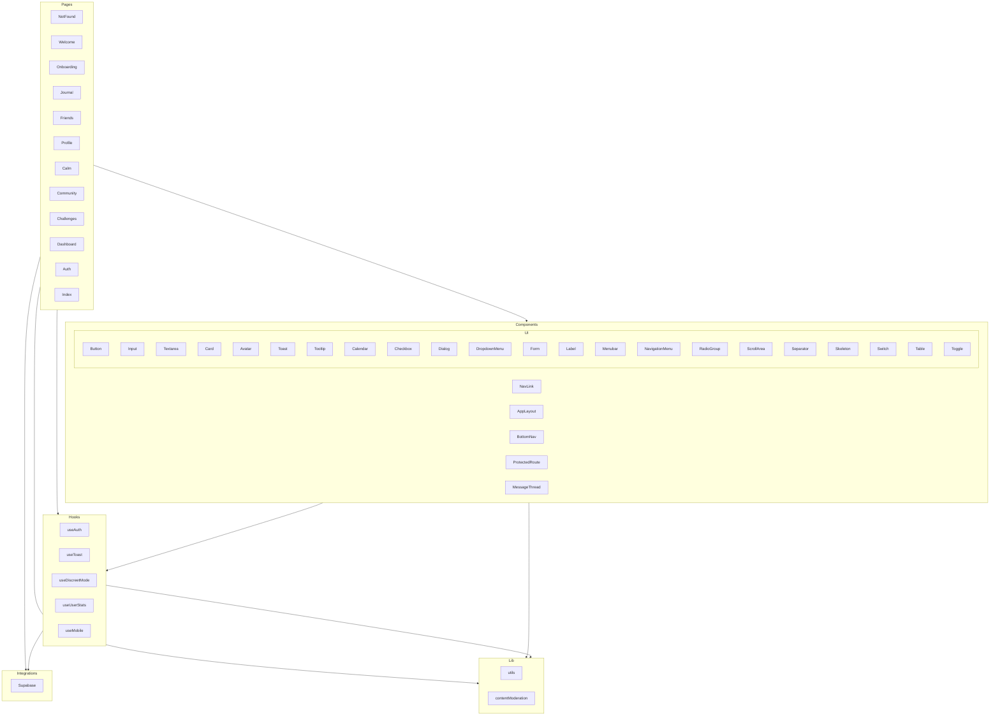

    

    <b>Automatic Architecture Diagrams from Code</b> 
    <a href="https://github.com/swark-io/swark">GitHub</a> • <a href="https://swark.io">Website</a> • <a href="mailto:contact@swark.io">Contact Us</a>

## Usage Instructions

1. **Render the Diagram**: Use the links below to open it in Mermaid Live Editor, or install the [Mermaid Support](https://marketplace.visualstudio.com/items?itemName=bierner.markdown-mermaid) extension.
2. **Recommended Model**: If available for you, use `claude-3.5-sonnet` [language model](vscode://settings/swark.languageModel). It can process more files and generates better diagrams.
3. **Iterate for Best Results**: Language models are non-deterministic. Generate the diagram multiple times and choose the best result.

## Generated Content
**Model**: GPT-4o - [Change Model](vscode://settings/swark.languageModel)  
**Mermaid Live Editor**: [View](https://mermaid.live/view#pako:eNp1VU1P5DAM_StVz_AH5rASMGJ3VjMsYkB7cDm4rWmjSeMqTfgQ4r9vkqbJDCwX-_k913FTJ30vG26pXJWV6jSOfXG_rlRRTLaew1vsaPJMUdywuWarWljA48z_JdnwQBB9ZP-omlG3QnWQYdR-s9UKJUQf2WstSLUTRB_ZW81PQhJEH9krlAN4s8Q8DFYJ8wYJLUqPUpJybwEZRm2NUx9ag4SicmFND97EeKNaeoVgA-MarNTJRrl1R1akTNytJDxsZqIoLq0xrGB2jwu7UaM1EGzi7unVoCaEBSTlynd7lRt1rT6jS4HZ5QqMk4FgjziWRowQ_VFNtyutq7GArPTUHGp-hQUkZS1Qcgezy6zmseUXtSNl4ThIGdesB_AmMVusSUKwifOP1K6h6BN_g8-iQyN4XuE0TFl32Ar-qdmOkGFS941mKS_87maYVRpRo2ENCWXtQJL8F1xAVl6EaXqYXd5vrN3gBnv0DbrOk8FFNgxTfL2tUAeIfpnFcdziG7shSSgql-wmaXDZkFA-NYYaQ-2dyw6H5yiMOTuaJne673v3_i2cRN_M-C_mQxxvO1E4I9E_JnYevAVkfi2mRhOZnbtu4FOcsx4m0nuDZoLjIOs7rv1lkNA3jW5FHR8xQrpa3sYiDSvjTqlfVofRgS_MN0U3Lq2bM-Im7O2INU4ECzh9Mtydxfn5j0-XQ-bThmYqtp6J02W9lqudFvnEh0qeDwn_qXWshOTyrBxIDyha90N4r0rT00BVuSqqsqUntNJU5YdLsmOLxn1BdLWGcmW0pbMSreH9m2qW2B26ri9XTygn-vgHgZQwmg) | [Edit](https://mermaid.live/edit#pako:eNp1VU1P5DAM_StVz_AH5rASMGJ3VjMsYkB7cDm4rWmjSeMqTfgQ4r9vkqbJDCwX-_k913FTJ30vG26pXJWV6jSOfXG_rlRRTLaew1vsaPJMUdywuWarWljA48z_JdnwQBB9ZP-omlG3QnWQYdR-s9UKJUQf2WstSLUTRB_ZW81PQhJEH9krlAN4s8Q8DFYJ8wYJLUqPUpJybwEZRm2NUx9ag4SicmFND97EeKNaeoVgA-MarNTJRrl1R1akTNytJDxsZqIoLq0xrGB2jwu7UaM1EGzi7unVoCaEBSTlynd7lRt1rT6jS4HZ5QqMk4FgjziWRowQ_VFNtyutq7GArPTUHGp-hQUkZS1Qcgezy6zmseUXtSNl4ThIGdesB_AmMVusSUKwifOP1K6h6BN_g8-iQyN4XuE0TFl32Ar-qdmOkGFS941mKS_87maYVRpRo2ENCWXtQJL8F1xAVl6EaXqYXd5vrN3gBnv0DbrOk8FFNgxTfL2tUAeIfpnFcdziG7shSSgql-wmaXDZkFA-NYYaQ-2dyw6H5yiMOTuaJne673v3_i2cRN_M-C_mQxxvO1E4I9E_JnYevAVkfi2mRhOZnbtu4FOcsx4m0nuDZoLjIOs7rv1lkNA3jW5FHR8xQrpa3sYiDSvjTqlfVofRgS_MN0U3Lq2bM-Im7O2INU4ECzh9Mtydxfn5j0-XQ-bThmYqtp6J02W9lqudFvnEh0qeDwn_qXWshOTyrBxIDyha90N4r0rT00BVuSqqsqUntNJU5YdLsmOLxn1BdLWGcmW0pbMSreH9m2qW2B26ri9XTygn-vgHgZQwmg)

