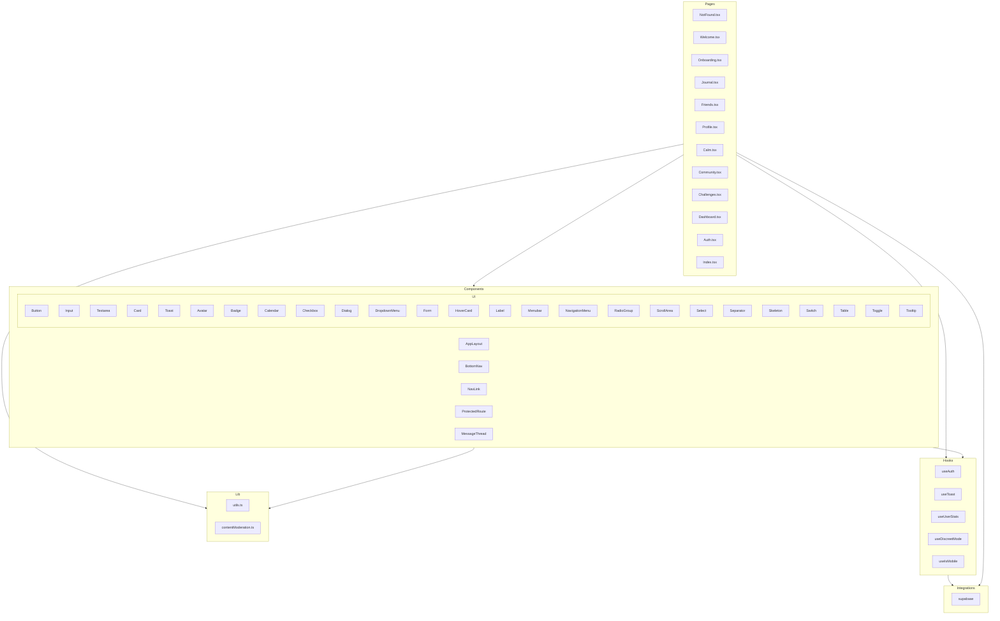

    

    <b>Automatic Architecture Diagrams from Code</b> 
    <a href="https://github.com/swark-io/swark">GitHub</a> • <a href="https://swark.io">Website</a> • <a href="mailto:contact@swark.io">Contact Us</a>

## Usage Instructions

1. **Render the Diagram**: Use the links below to open it in Mermaid Live Editor, or install the [Mermaid Support](https://marketplace.visualstudio.com/items?itemName=bierner.markdown-mermaid) extension.
2. **Recommended Model**: If available for you, use `claude-3.5-sonnet` [language model](vscode://settings/swark.languageModel). It can process more files and generates better diagrams.
3. **Iterate for Best Results**: Language models are non-deterministic. Generate the diagram multiple times and choose the best result.

## Generated Content
**Model**: GPT-4o - [Change Model](vscode://settings/swark.languageModel)  
**Mermaid Live Editor**: [View](https://mermaid.live/view#pako:eNp9VU1P5DAM_StVzws_YA4rASOWWTEs4kN78HBwW9NGk8ZVksIgxH_fNE2TDIi92M_vOWnixOl7WXND5arcqVbj0BUP650qCjNWc3iLLZmJKYobtpc8qgYWcGrN4WnW_pKsuScIPlP-qIpRN0K1kGCm_-ZRK5QQfKZcakGqMRB8ptxqfhaSIPhMuUDZw2Ryjvt-VMK-QUS52qGUpNwuIcFMX6Pp_LIhokw9G20Hk8m4jWroAN5G1m1gp44K69YysCJlQ3Wj8LiZiaI4H61lBbN7WtiNGkYL3kbugQ4WNSEsICoX08onk3IZjQVvI3f2gm4YzC6y59i0BN5m87kKNS53AUnpqN5XfIAFRGUtUHILs0us5qHhV7UlNUIexIxL1j1MJjJX_ELabymiqF1jRRK8jdw0XeUWG3zkb_BFtGgFz18_DmPWHTaCf2keB0gwqve1ZinPpqonmFSSVFuYXcYOqNGyhoiStne503kvICmvwtYdzC6dI1auBbzNzrZtJ9K7jGVpxQDBBz5eSXf8w3CNb-yuVUQh6Zzd3etdfSCioDh0LdQegk-dad2Gqblzc_gGzcKQsyVj3Kvy0Ll6NXAUfdMrV8z70CajId9zwT9Fdr7WC0j8oyF9b9EayIOkr4WpNZHdumcQPsUpa2O2XE1PToa_Wey1qMIwK6T76mRP4xdrVtY1_TS79jcOvjBL8tepNy6znZPiqzFghYZgAccj_etdnJz8_PTcJD6WNlFhA2nEf9g43ANPfV5kmvhYKX-UPekeReP-Pu-70nbU065cFbuyoWccpd2VHy5pHBq07ljQDe3LldUj_ShxtHz_puoldp3ZduXqGaWhj3_41ld5) | [Edit](https://mermaid.live/edit#pako:eNp9VU1P5DAM_StVzws_YA4rASOWWTEs4kN78HBwW9NGk8ZVksIgxH_fNE2TDIi92M_vOWnixOl7WXND5arcqVbj0BUP650qCjNWc3iLLZmJKYobtpc8qgYWcGrN4WnW_pKsuScIPlP-qIpRN0K1kGCm_-ZRK5QQfKZcakGqMRB8ptxqfhaSIPhMuUDZw2Ryjvt-VMK-QUS52qGUpNwuIcFMX6Pp_LIhokw9G20Hk8m4jWroAN5G1m1gp44K69YysCJlQ3Wj8LiZiaI4H61lBbN7WtiNGkYL3kbugQ4WNSEsICoX08onk3IZjQVvI3f2gm4YzC6y59i0BN5m87kKNS53AUnpqN5XfIAFRGUtUHILs0us5qHhV7UlNUIexIxL1j1MJjJX_ELabymiqF1jRRK8jdw0XeUWG3zkb_BFtGgFz18_DmPWHTaCf2keB0gwqve1ZinPpqonmFSSVFuYXcYOqNGyhoiStne503kvICmvwtYdzC6dI1auBbzNzrZtJ9K7jGVpxQDBBz5eSXf8w3CNb-yuVUQh6Zzd3etdfSCioDh0LdQegk-dad2Gqblzc_gGzcKQsyVj3Kvy0Ll6NXAUfdMrV8z70CajId9zwT9Fdr7WC0j8oyF9b9EayIOkr4WpNZHdumcQPsUpa2O2XE1PToa_Wey1qMIwK6T76mRP4xdrVtY1_TS79jcOvjBL8tepNy6znZPiqzFghYZgAccj_etdnJz8_PTcJD6WNlFhA2nEf9g43ANPfV5kmvhYKX-UPekeReP-Pu-70nbU065cFbuyoWccpd2VHy5pHBq07ljQDe3LldUj_ShxtHz_puoldp3ZduXqGaWhj3_41ld5)

